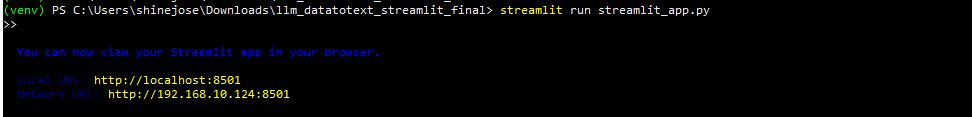
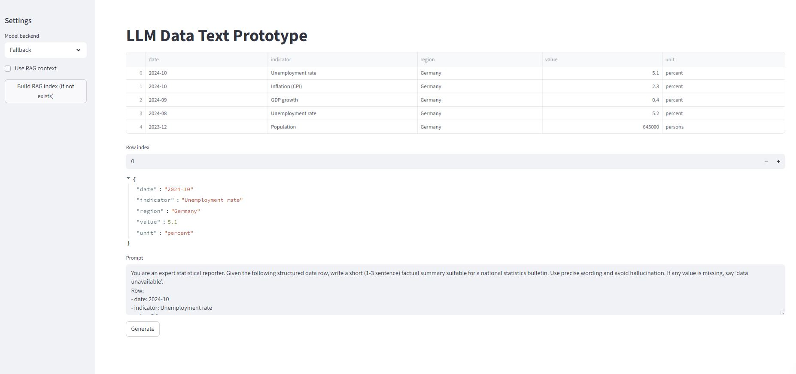
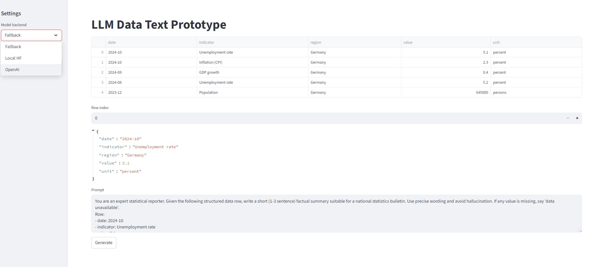

## LLM Data Text Prototype - Shine Jose

This final package includes:
- RAG (FAISS + SQLite metadata) with embedding caching (saved SentenceTransformer model files)
- Evaluation notebook with batching and CSV export of metrics
- Pytest test suite to validate core functions

## Quick setup
1. Create and activate a virtual environment:

```bash
python -m venv .venv
source .venv/bin/activate  # macOS / Linux
.\.venv\\Scripts\\activate # Windows
```

2. Install dependencies (this may take time because of faiss and sentence-transformers):

```bash
pip install -r requirements.txt
```

3. Run the Streamlit app:

```bash
streamlit run app/streamlit_app.py
# or
streamlit run app/eval_ui.py  # human eval UI
```

4. Build the RAG index from the app sidebar or programmatically:

```python
from app.rag import build_index
build_index()
```

5. Run tests:

```bash
pytest -q
```

6. Run the evaluation notebook (batch evaluation + CSV export):

Open `notebooks/evaluation_batch.ipynb` in Jupyter and run all cells.

## Files of interest
- `app/rag.py` — RAG functions + embedding caching + sqlite metadata
- `notebooks/evaluation_batch.ipynb` — batch evaluation producing `data/eval_metrics.csv`
- `tests/test_basic.py` — pytest suite


Outputs

<p align="center"></p>
<p align="center"></p>
<p align="center"></p>
<p align="center"></p>


**Author:** Shine Jose
**License:** MIT (see LICENSE file)

This repository is provided as sample educational content by Shine Jose..... Use and modify freely.....
